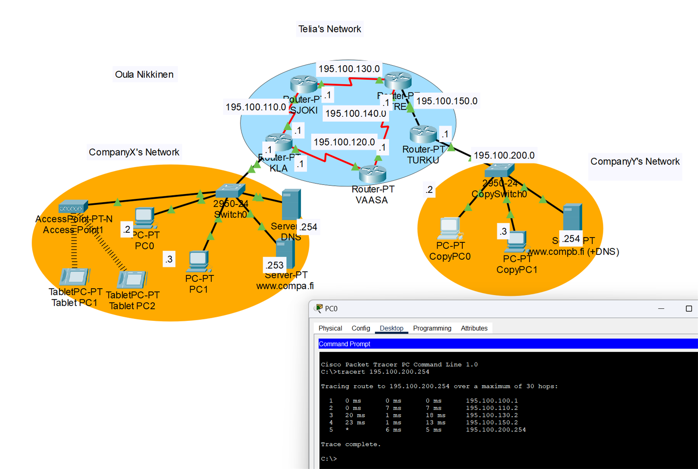

# simulation-network-env
Repository for my Cisco Packet Tracer files. 
Themes will be around Introduction to Internet and IP Networks,  overall structure and functioning, IP Protocols, IP in Local Area Network, Domain Name System (DNS), Transport Layer - TCP and UDP, Transport Layer - Network Address Translation (NAT), Applications and Information Security

 [Please start from overview.ipynb](overview.ipynb) where you can find the themes I have worked on and the table of contents.

 

